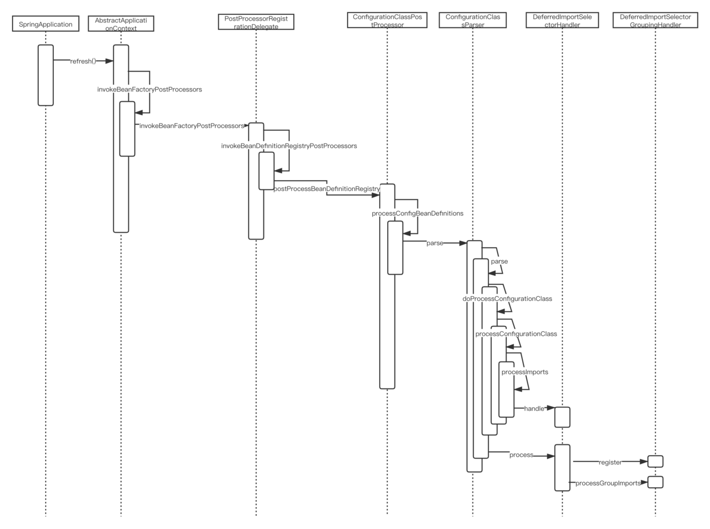
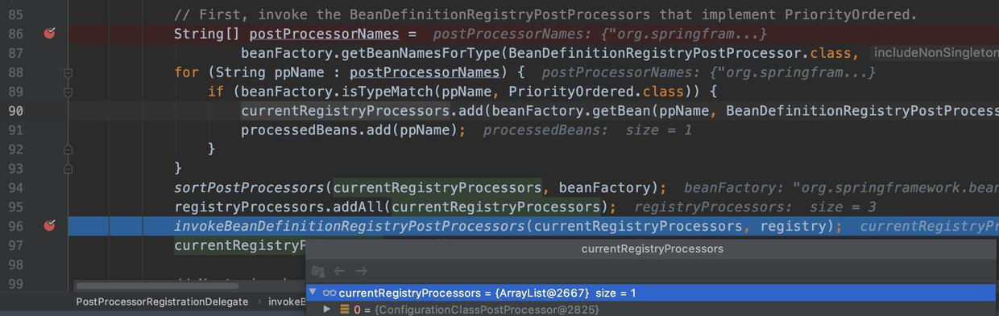
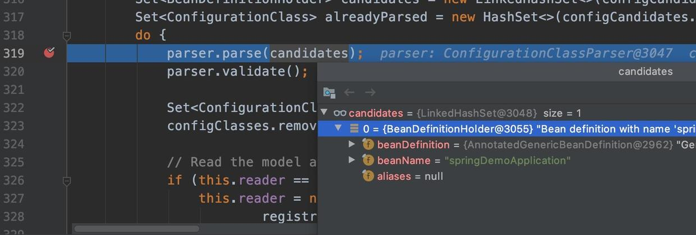

# 一. Spring的自动装配

## 1. 自动装配的含义:

我理解 将一些配置类无需手动配置,通过引用的jar包 /WEB-INFO/spring.factories文件 默认配置,就可以注入到spring中,完成项目的初始化.

## 2. 关键注解

```java
@SpringBootApplication(exclude = {FreeMarkerAutoConfiguration})//启动类注解 排除configuration初始化
public class Application {
    public static void main(String[] args) {
        SpringApplication.run(Application.class, args);
    }
}
```

查看启动注解就能发现内部结构

```java
@Target(ElementType.TYPE) // 注解的适用范围，其中TYPE用于描述类、接口（包括包注解类型）或enum声明
@Retention(RetentionPolicy.RUNTIME) // 注解的生命周期，保留到class文件中（三个生命周期）
@Documented // 表明这个注解应该被javadoc记录
@Inherited // 子类可以继承该注解
@SpringBootConfiguration // 继承了Configuration，表示当前是注解类
@EnableAutoConfiguration // 开启springboot的注解功能，springboot的四大神器之一，其借助@import的帮助
@ComponentScan(excludeFilters = { // 扫描路径设置（排除自定义bean(非configuration)初始化到ioc容器中）
@Filter(type = FilterType.CUSTOM, classes = TypeExcludeFilter.class),
@Filter(type = FilterType.CUSTOM, classes = AutoConfigurationExcludeFilter.class) })
public @interface SpringBootApplication {
...
} 

```


### 2.1 @EnableAutoConfiguration 

此注解顾名思义是可以自动配置，所以应该是springboot中最为重要的注解。

在spring框架中就提供了各种以@Enable开头的注解，例如： @EnableScheduling、@EnableCaching、@EnableMBeanExport等； @EnableAutoConfiguration的理念和做事方式其实一脉相承简单概括一下就是，**借助@Import的支持，收集和注册特定场景相关的bean定义。**

@EnableScheduling是通过@Import将Spring调度框架相关的bean定义都加载到IoC容器【定时任务、时间调度任务】
@EnableMBeanExport是通过@Import将JMX相关的bean定义加载到IoC容器【监控JVM运行时状态】
@EnableAutoConfiguration也是借助@Import的帮助，将所有符合自动配置条件的bean定义加载到IoC容器。

```java
@SuppressWarnings("deprecation")
@Target(ElementType.TYPE)
@Retention(RetentionPolicy.RUNTIME)
@Documented
@Inherited
@AutoConfigurationPackage //AutoConfigurationPackage.Register.class 实现类,它其实是注册了一个Bean的定义。new PackageImport(metadata).getPackageName()，它其实返回了当前主程序类的 同级以及子级的包组件。这也就是为什么，我们要把Application放在项目的最高级中
@Import(AutoConfigurationImportSelector.class) //实现类 最为重要下面讲解
public @interface EnableAutoConfiguration {
...
}
```

## 3. 解析自动装配实现类

AutoConfigurationImportSelector  该类实现ImportSelector接口，最重要的是实现selectImports方法，该方法的起到的作用是，根据配置文件（spring.factories），将需要注入到容器的bean注入到容器。

### 3.1 selectImports 


```java
/**
* AnnotationMetadata 注解元数据 作用: 导入bean
*/
@Override
public String[] selectImports(AnnotationMetadata annotationMetadata) {
		if (!isEnabled(annotationMetadata)) {
			return NO_IMPORTS;
		}
		AutoConfigurationMetadata autoConfigurationMetadata = AutoConfigurationMetadataLoader
				.loadMetadata(this.beanClassLoader);
		AutoConfigurationEntry autoConfigurationEntry = getAutoConfigurationEntry(autoConfigurationMetadata,
				annotationMetadata);
		return StringUtils.toStringArray(autoConfigurationEntry.getConfigurations());
	}

```

### 3.2 isEnabled 

```java
/**
* 作用:自动装配开关
*/
protected boolean isEnabled(AnnotationMetadata metadata) {   
    // 判断当前实例的class   
    if (getClass() == AutoConfigurationImportSelector.class) {      
        // 返回 spring.boot.enableautoconfiguration 的值，如果为null，返回true      
        // spring.boot.enableautoconfiguration 可在配置文件中配置，不配则为null      
        return getEnvironment().getProperty(EnableAutoConfiguration.ENABLED_OVERRIDE_PROPERTY, Boolean.class, true);   
    }   
    return true; 
} 
```

### 3.3 getAutoConfigurationEntry 

```java
/**
*  作用 :读取/装配/去重/排除/校验/过滤/监听
*/
protected AutoConfigurationEntry getAutoConfigurationEntry(AutoConfigurationMetadata autoConfigurationMetadata,
			AnnotationMetadata annotationMetadata) {   
    // 检查自动装配开关   
    if (!isEnabled(annotationMetadata)) {      
        return EMPTY_ENTRY;   
    }   
    // 获取EnableAutoConfiguration中的参数，exclude()/excludeName()   
    AnnotationAttributes attributes = getAttributes(annotationMetadata);   
    // 获取需要自动装配的所有配置类，读取META-INF/spring.factories   
    List<String> configurations = getCandidateConfigurations(annotationMetadata, attributes);   
    // 去重,List转Set再转List   
    configurations = removeDuplicates(configurations);   
    // 从EnableAutoConfiguration的exclude/excludeName属性中获取排除项   
    Set<String> exclusions = getExclusions(annotationMetadata, attributes);   
    // 检查需要排除的类是否在configurations中，不在报错   
    // 这里决定了如果是你自己定义的bean不要使用这个 要使用@Compontscan filter
    checkExcludedClasses(configurations, exclusions);   
    // 从configurations去除exclusions   
    configurations.removeAll(exclusions);   
    // 对configurations进行过滤，剔除掉不满足 spring-autoconfigure-metadata.properties 所写条件的配置类 
    // OnBeanCondition.class  注解@ConditionalsigleCandidate(xxx.class)
    configurations = filter(configurations, autoConfigurationMetadata);  
    // 监听器 import 事件回调 主要是打印自动装配/排除的配置类
    fireAutoConfigurationImportEvents(configurations, exclusions);   
    // 返回(configurations, exclusions)组   
    return new AutoConfigurationEntry(configurations, exclusions); } 
```

### 3.4 getCandidateConfigurations 

```java
/** 作用读取spring.factories
     * Return the auto-configuration class names that should be considered. By default
     * this method will load candidates using {@link SpringFactoriesLoader} with
     * {@link #getSpringFactoriesLoaderFactoryClass()}.
     * @param metadata the source metadata
     * @param attributes the {@link #getAttributes(AnnotationMetadata) annotation
     * attributes}
     * @return a list of candidate configurations
     */
    protected List<String> getCandidateConfigurations(AnnotationMetadata metadata,
            AnnotationAttributes attributes) {
        List<String> configurations = SpringFactoriesLoader.loadFactoryNames(
                getSpringFactoriesLoaderFactoryClass(), getBeanClassLoader());
        Assert.notEmpty(configurations,
                "No auto configuration classes found in META-INF/spring.factories. If you "
                        + "are using a custom packaging, make sure that file is correct.");
        return configurations;
    }

/**
     * Return the class used by {@link SpringFactoriesLoader} to load configuration
     * candidates.
     * @return the factory class
     */
    protected Class<?> getSpringFactoriesLoaderFactoryClass() {
        return EnableAutoConfiguration.class;
    }
```

**note**: 自动配置幕后英雄：SpringFactoriesLoader详解

借助于Spring框架原有的一个工具类：SpringFactoriesLoader的支持，@EnableAutoConfiguration可以智能的自动配置功效才得以大功告成！

SpringFactoriesLoader属于Spring框架私有的一种扩展方案，其主要功能就是从指定的配置文件META-INF/spring.factories加载配置。

```java
public abstract class SpringFactoriesLoader {
//...
 public static <T> List<T> loadFactories(Class<T> factoryClass, ClassLoader classLoader) {
 ...
 }

 public static List<String> loadFactoryNames(Class<?> factoryClass, ClassLoader classLoader) {
 ....
 }
}
```

### 3.5 getExclusions/checkExcludedClasses

```java
/**
     * Return any exclusions that limit the candidate configurations.
     * @param metadata the source metadata
     * @param attributes the {@link #getAttributes(AnnotationMetadata) annotation
     * attributes}
     * @return exclusions or an empty set
     */
    protected Set<String> getExclusions(AnnotationMetadata metadata,
            AnnotationAttributes attributes) {
        Set<String> excluded = new LinkedHashSet<String>();
        excluded.addAll(asList(attributes, "exclude"));
        excluded.addAll(Arrays.asList(attributes.getStringArray("excludeName")));
        excluded.addAll(getExcludeAutoConfigurationsProperty());
        return excluded;
    }

/**
* 检查需要排除的类是否在configurations中，不在报错 
*/
 private void checkExcludedClasses(List<String> configurations,
            Set<String> exclusions) {
        List<String> invalidExcludes = new ArrayList<String>(exclusions.size());
        for (String exclusion : exclusions) {
            if (ClassUtils.isPresent(exclusion, getClass().getClassLoader())
                    && !configurations.contains(exclusion)) {
                invalidExcludes.add(exclusion);
            }
        }
        if (!invalidExcludes.isEmpty()) {
            handleInvalidExcludes(invalidExcludes);
        }
    }
```

**note** :

- @SpringBootApplication(**exclude** = {FreeMarkerAutoConfiguration})
- 看源码分析得 关于exclude 会有三种方式1.exclude 类路径 2.excludeName 类名称 3.配置中 spring.autoconfigure.exclude 配置
- 这里决定了如果是你自己定义的bean不要使用这个 要使用@Compontscan filter

### 3.6 filter

```java
/**
*  对configurations进行过滤，剔除掉不满足 spring-autoconfigure-metadata.properties 所写条件的配置类
*/
private List<String> filter(List<String> configurations,
            AutoConfigurationMetadata autoConfigurationMetadata) {
        long startTime = System.nanoTime();
        String[] candidates = configurations.toArray(new String[configurations.size()]);
        boolean[] skip = new boolean[candidates.length];
        boolean skipped = false;
        for (AutoConfigurationImportFilter filter : getAutoConfigurationImportFilters()) {
            invokeAwareMethods(filter);
            boolean[] match = filter.match(candidates, autoConfigurationMetadata);
            for (int i = 0; i < match.length; i++) {
                if (!match[i]) {
                    skip[i] = true;
                    skipped = true;
                }
            }
        }
        if (!skipped) {
            return configurations;
        }
        List<String> result = new ArrayList<String>(candidates.length);
        for (int i = 0; i < candidates.length; i++) {
            if (!skip[i]) {
                result.add(candidates[i]);
            }
        }
        if (logger.isTraceEnabled()) {
            int numberFiltered = configurations.size() - result.size();
            logger.trace("Filtered " + numberFiltered + " auto configuration class in "
                    + TimeUnit.NANOSECONDS.toMillis(System.nanoTime() - startTime)
                    + " ms");
        }
        return new ArrayList<String>(result);
    }
```

**note** :

- OnBeanCondition.class  注解@ConditionalsigleCandidate(xxx.class)      
-  AutoConfigurationImportFilter.match() 方法关键
- 通俗讲 我实例化Configuration A时,前提条件Configuration B已经在了,不然过滤

### 3.7 fireAutoConfigurationImportEvents

```java
/**
*最后让所有配置在META-INF/spring.factories下的AutoConfigurationImportListener执行AutoConfigurationImportEvent事件
*/
private void fireAutoConfigurationImportEvents(List<String> configurations,
            Set<String> exclusions) {
        List<AutoConfigurationImportListener> listeners = getAutoConfigurationImportListeners();
        if (!listeners.isEmpty()) {
            AutoConfigurationImportEvent event = new AutoConfigurationImportEvent(this,
                    configurations, exclusions);
            for (AutoConfigurationImportListener listener : listeners) {
                invokeAwareMethods(listener);
                listener.onAutoConfigurationImportEvent(event);
            }
        }
    }

    protected List<AutoConfigurationImportListener> getAutoConfigurationImportListeners() {
        return SpringFactoriesLoader.loadFactories(AutoConfigurationImportListener.class,
                this.beanClassLoader);
    }
```

**note** : 

-  创建自定义AutoConfigurationImportListener

- **目的:  输出当前工程自动装配类和排除类信息**

  利用自定义AutoConfigurationImportListener来实现。

  **3.5.1 创建自定义AutoConfigurationImportListener**

  ```java
    public class DefaultAutoConfigurationImportListener implements AutoConfigurationImportListener {
      @Override
      public void onAutoConfigurationImportEvent(AutoConfigurationImportEvent event) {
          // Acquire current ClassLoader
          ClassLoader classLoader = event.getClass().getClassLoader();
          // Candidate autoconfig list
          List<String> candidates =
                  SpringFactoriesLoader.loadFactoryNames(EnableAutoConfiguration.class, classLoader);
          // Actual config class list
          List<String> configurations = event.getCandidateConfigurations();
          // Exclude class list
          Set<String> exclusions = event.getExclusions();
          // Print info
          System.out.printf("Autoconfig Class list - Candidate Num: %d, actual Num: %d, exclusion num: %s
  ",
                  candidates.size(), configurations.size(), exclusions.size());
          // Print actual and exclusion class list
          System.out.println("Actual config class list: ");
          event.getCandidateConfigurations().forEach(System.out::println);
          System.out.println("Exclusion class list: ");
          event.getExclusions().forEach(System.out::println);
      }
  }       
  ```

  **3.5.2 新建配置文件resources/META-INF/spring.factories**

  ```properties
  ## Auto Configuration Import Listeners Self Implement
  ## 此处是你本地自定义类的权限类名
  org.springframework.boot.autoconfigure.AutoConfigurationImportListener=xxx.yyy.DefaultAutoConfigurationImportListener 
  
  ```

  **3.5.3 创建引导启动类**

  ```java
  // 此处排除RestTemplate自动配置类，测试后面是否会打印出来
  @EnableAutoConfiguration(exclude = RestTemplateAutoConfiguration.class)
  public class EnableAutoConfigurationBootstrap {
      public static void main(String[] args) {
          new SpringApplicationBuilder(EnableAutoConfigurationBootstrap.class)
                  .web(WebApplicationType.NONE)// non-web app
                  .run(args)
                  .close();// close current context
      }
  }            
  ```

  **3.5.4 测试结果**     

  ```java
  // 结果
  Autoconfig Class list - Candidate Num: 127, actual Num: 25, exclusion num: 1
  Actual config class list:
  ...
  org.springframework.boot.autoconfigure.admin.SpringApplicationAdminJmxAutoConfiguration
  org.springframework.boot.autoconfigure.cache.CacheAutoConfiguration
  org.springframework.boot.autoconfigure.web.servlet.WebMvcAutoConfiguration
  org.springframework.boot.autoconfigure.websocket.servlet.WebSocketServletAutoConfiguration
  Exclusion class list:
  org.springframework.boot.autoconfigure.web.client.RestTemplateAutoConfiguration
  ```

  ​       

## 4. 何时进行自动装配

在前面的环节里只是最终要确定哪些类需要被装配，在SpringBoot时何时处理这些自动装配的类呢？下面我们简要的分析一下：

.png)

### 4.1 序列图

先摆上debug的时序图，方法返回没画（太丑，me嫌弃，有个大概了解一下就行）



### 4.2. 代码分析

代码太多，跳过了部分简单代码，然后挑关键点说。

1. 从这SpringApplication#refresh当入口

```java
	protected void refresh(ConfigurableApplicationContext applicationContext) {
    // 调用父类的refresh方法
		applicationContext.refresh();
	}
```

2. 进入 org.springframework.context.support.AbstractApplicationContext#refresh方法

```java
public void refresh() throws BeansException, IllegalStateException {
		synchronized (this.startupShutdownMonitor) {

			// Invoke factory processors registered as beans in the context.
      // 调用BeanFactory前置处理器
			invokeBeanFactoryPostProcessors(beanFactory);
	}
```

3. 进入 org.springframework.context.support.PostProcessorRegistrationDelegate#invokeBeanFactoryPostProcessors，这有关键点，就是生成的postProcessorNames

```java
			// First, invoke the BeanDefinitionRegistryPostProcessors that implement PriorityOrdered.
			// 
			String[] postProcessorNames =
					beanFactory.getBeanNamesForType(BeanDefinitionRegistryPostProcessor.class, true, false);
			
			for (String ppName : postProcessorNames) {
				if (beanFactory.isTypeMatch(ppName, PriorityOrdered.class)) {
					currentRegistryProcessors.add(beanFactory.getBean(ppName, BeanDefinitionRegistryPostProcessor.class));
					processedBeans.add(ppName);
				}
			}

			...
      // 调用BeanDefinitionRegistry前置处理器  
			invokeBeanDefinitionRegistryPostProcessors(currentRegistryProcessors, registry);
		
```

Debug图片



我们通过Debug可以看出，currentRegistryProcessors 中放的是ConfigurationClassPostProcessor  的Bean对象，接着就调用了 invokeBeanDefinitionRegistryPostProcessors 方法并传入 ConfigurationClassPostProcessor。

4. 接着进入org.springframework.context.annotation.ConfigurationClassPostProcessor#processConfigBeanDefinitions方法

```java
	public void processConfigBeanDefinitions(BeanDefinitionRegistry registry) {
    
    ...
    // 从BeanDefinition中找出带有Configuration.class的，自己Debug可以进入if的两个方法中查看
		for (String beanName : candidateNames) {
			BeanDefinition beanDef = registry.getBeanDefinition(beanName);
			if (beanDef.getAttribute(ConfigurationClassUtils.CONFIGURATION_CLASS_ATTRIBUTE) != null) {
				if (logger.isDebugEnabled()) {
					logger.debug("Bean definition has already been processed as a configuration class: " + beanDef);
				}
			}
			else if (ConfigurationClassUtils.checkConfigurationClassCandidate(beanDef, this.metadataReaderFactory)) {
				configCandidates.add(new BeanDefinitionHolder(beanDef, beanName));
			}
		}
		...
		// 传入候选人
    parser.parse(candidates);
		
		...
	}
```

Debug图片



通过图片，可以看出，`candidates 只有一个，那就是启动类SpringDemoApplication（测试项目的启动类）.

5. 进入 org.springframework.context.annotation.ConfigurationClassParser#parse()`方法，开始解析启动类。

```java
	public void parse(Set<BeanDefinitionHolder> configCandidates) {
		for (BeanDefinitionHolder holder : configCandidates) {
			BeanDefinition bd = holder.getBeanDefinition();
			try {
				if (bd instanceof AnnotatedBeanDefinition) {
          // 进入此方法了。 这我是Debug进去的，没有探究启动类在被解析成BeanDefinition的时候，被解析成
          // AnnotatedBeanDefinition， 有兴趣的同学自己Debug追究一下
					parse(((AnnotatedBeanDefinition) bd).getMetadata(), holder.getBeanName());
				}
			}
    ...
    // 这个有用，所以我留在这了，关键点。  
		this.deferredImportSelectorHandler.process();
	}
```

6. 接下来进入 org.springframework.context.annotation.ConfigurationClassParser#processConfigurationClass方法。

```java
protected void processConfigurationClass(ConfigurationClass configClass, Predicate<String> filter) throws IOException {
		...
		
    // Recursively process the configuration class and its superclass hierarchy.
		SourceClass sourceClass = asSourceClass(configClass, filter);
		do {
      // 我们可以通过注解，看出这个是循环调用,找到configClass 自己的configuration注解或继承的注解中包含configuration的
      // 不用多纠结，我们直接找到
			sourceClass = doProcessConfigurationClass(configClass, sourceClass, filter);
		}
		while (sourceClass != null);
	}
```

7. 进入 org.springframework.context.annotation.ConfigurationClassParser#doProcessConfigurationClass`方法，直接分析代码.

```java
protected final SourceClass doProcessConfigurationClass(
			ConfigurationClass configClass, SourceClass sourceClass, Predicate<String> filter)
			throws IOException {

		if (configClass.getMetadata().isAnnotated(Component.class.getName())) {
			// Recursively process any member (nested) classes first
      // 在这递归的，会回到上一步代码中
			processMemberClasses(configClass, sourceClass, filter);
		}


		// Process any @Import annotations
  	// 别的代码不看，就这个名字，我们也知道这个类是干嘛的了吧！
		processImports(configClass, sourceClass, getImports(sourceClass), filter, true);
	}
```

8. getImports(sourceClass) 这个方法是递归调用，找到注解Import中的值。 放个Debug图给大家瞅一下。CustomizedImportSelector 是我自己测试的，

```java
/**
 * <br>自定义importSelector</br>
 *
 * @author fattyca1
 */
public class CustomizedImportSelector implements ImportSelector {

    @Override
    public String[] selectImports(AnnotationMetadata importingClassMetadata) {

        return new String[]{"com.spring.demo.config.MyConfig"};
    }
}
```

值)

9. 进入org.springframework.context.annotation.ConfigurationClassParser#processImports 方法，核心来了，就是问题的关键，到底是怎么使用SpringSPI的

```java
private void processImports(ConfigurationClass configClass, SourceClass currentSourceClass,
			Collection<SourceClass> importCandidates, Predicate<String> exclusionFilter,
			boolean checkForCircularImports) {
		...
		if (checkForCircularImports && isChainedImportOnStack(configClass)) {
			this.problemReporter.error(new CircularImportProblem(configClass, this.importStack));
		}
		else {
			this.importStack.push(configClass);
			try {
				for (SourceClass candidate : importCandidates) {
					if (candidate.isAssignable(ImportSelector.class)) {
						// Candidate class is an ImportSelector -> delegate to it to determine imports
						Class<?> candidateClass = candidate.loadClass();
						ImportSelector selector = ParserStrategyUtils.instantiateClass(candidateClass, ImportSelector.class,
								this.environment, this.resourceLoader, this.registry);
						Predicate<String> selectorFilter = selector.getExclusionFilter();

						if (selector instanceof DeferredImportSelector) {
              // 因为AutoConfigurationImportSelector继承了DeferredImportSelector，所以会进入这个方法，放到
              // 列表里处理，直接放到一个List中。
							this.deferredImportSelectorHandler.handle(configClass, (DeferredImportSelector) selector);
						}
					}
        }
        ...
			}
		}
	}
```

10 .org.springframework.context.annotation.ConfigurationClassParser.DeferredImportSelectorHandler#handle 方法

```java
public void handle(ConfigurationClass configClass, DeferredImportSelector importSelector) {
			DeferredImportSelectorHolder holder = new DeferredImportSelectorHolder(configClass, importSelector);
			if (this.deferredImportSelectors == null) {
				DeferredImportSelectorGroupingHandler handler = new DeferredImportSelectorGroupingHandler();
				handler.register(holder);
				handler.processGroupImports();
			}
			else {
        // deferredImportSelectors 是一个ArrayList，在类部类中被初始化，所以走的此方法
				this.deferredImportSelectors.add(holder);
			}
		}
```

自此，我们分析完AutoConfigurationImportSelector在第一遍解析完后，被放在哪，那接下来就是如何解析了。激动人心的时刻来了。那就是在 ConfigurationClassParser#parse() 中执行的代码了this.deferredImportSelectorHandler.process();

11. org.springframework.context.annotation.ConfigurationClassParser.DeferredImportSelectorHandler#process代码

```java
	public void process() {
			List<DeferredImportSelectorHolder> deferredImports = this.deferredImportSelectors;
			this.deferredImportSelectors = null;
			try {
				if (deferredImports != null) {
					DeferredImportSelectorGroupingHandler handler = new DeferredImportSelectorGroupingHandler();
					deferredImports.sort(DEFERRED_IMPORT_COMPARATOR);
          // 把list中的DeferredImportSelectorHolder注册到DeferredImportSelectorGroupingHandler
          // 这个register方法会对DeferredImportSelectorHolder进行封装
					deferredImports.forEach(handler::register);
					handler.processGroupImports();
				}
			}
			finally {
				this.deferredImportSelectors = new ArrayList<>();
			}
		}
```

12. org.springframework.context.annotation.ConfigurationClassParser.DeferredImportSelectorGroupingHandler#register代码

```java
		public void register(DeferredImportSelectorHolder deferredImport) {
      // AutoConfigurationImportSelector返回的是AutoConfigurationGroup.class，代码中已写死
			Class<? extends Group> group = deferredImport.getImportSelector().getImportGroup();
      // 封装成 DeferredImportSelector.Group 对象，并放到了groupings中，groupings是LinkedHashMap
      // Group对象是用AutoConfigurationGroup.class生成
			DeferredImportSelectorGrouping grouping = this.groupings.computeIfAbsent(
					(group != null ? group : deferredImport),
					key -> new DeferredImportSelectorGrouping(createGroup(group)));
			grouping.add(deferredImport);
			this.configurationClasses.put(deferredImport.getConfigurationClass().getMetadata(),
					deferredImport.getConfigurationClass());
		}
```

13. org.springframework.context.annotation.ConfigurationClassParser.DeferredImportSelectorGroupingHandler#processGroupImports 方法，SpringSPI的调用点

```java
public void processGroupImports() {
			for (DeferredImportSelectorGrouping grouping : this.groupings.values()) {
				Predicate<String> exclusionFilter = grouping.getCandidateFilter();
        //遍历放入到grouping中的group，并执行getImports()方法，此方法就是SPI调用点！！！！
				grouping.getImports().forEach(entry -> {
					ConfigurationClass configurationClass = this.configurationClasses.get(entry.getMetadata());
					try {
						processImports(configurationClass, asSourceClass(configurationClass, exclusionFilter),
								Collections.singleton(asSourceClass(entry.getImportClassName(), exclusionFilter)),
								exclusionFilter, false);
					}
					catch (BeanDefinitionStoreException ex) {
						throw ex;
					}
					catch (Throwable ex) {
						throw new BeanDefinitionStoreException(
								"Failed to process import candidates for configuration class [" +
										configurationClass.getMetadata().getClassName() + "]", ex);
					}
				});
			}
		}
```

14. org.springframework.context.annotation.ConfigurationClassParser.DeferredImportSelectorGrouping#getImports

```java
		public Iterable<Group.Entry> getImports() {
			for (DeferredImportSelectorHolder deferredImport : this.deferredImports) {
        // 调用group的process方法, 也就是上面分析，AutoConfigurationGroup.class类的process方法
				this.group.process(deferredImport.getConfigurationClass().getMetadata(),
						deferredImport.getImportSelector());
			}
			return this.group.selectImports();
		}
```

15.  org.springframework.boot.autoconfigure.AutoConfigurationImportSelector.AutoConfigurationGroup#process 方法

```java
		public void process(AnnotationMetadata annotationMetadata, DeferredImportSelector deferredImportSelector) {
			Assert.state(deferredImportSelector instanceof AutoConfigurationImportSelector,
					() -> String.format("Only %s implementations are supported, got %s",
							AutoConfigurationImportSelector.class.getSimpleName(),
							deferredImportSelector.getClass().getName()));
      // getAutoConfigurationEntry 熟悉的方法，SPI的具体执行逻辑
			AutoConfigurationEntry autoConfigurationEntry = ((AutoConfigurationImportSelector) deferredImportSelector)
					.getAutoConfigurationEntry(annotationMetadata);
			this.autoConfigurationEntries.add(autoConfigurationEntry);
			for (String importClassName : autoConfigurationEntry.getConfigurations()) {
				this.entries.putIfAbsent(importClassName, annotationMetadata);
			}
		}
```

自此，我们的代码分析结束，发现`AutoConfigurationImportSelector.class`在SpringBoot启动中，并不是调用的selectImports方法，而是直接调用的`getAutoConfigurationEntry`方法

### 4.3. 总结

SpringBoot在启动中，`AutoConfigurationImportSelector`在被加载中，调用的不是selectImports方法， 而是直接被调用了getAutoConfigurationEntry方法。


引用 : 4.1 4.2 4.3 https://www.cnblogs.com/lifacheng/p/12971628.html


